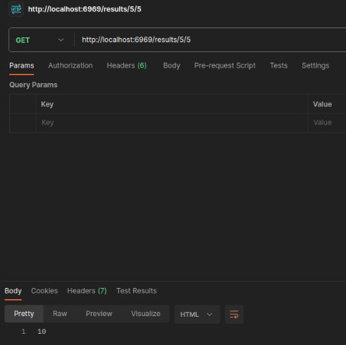
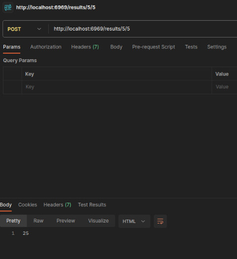
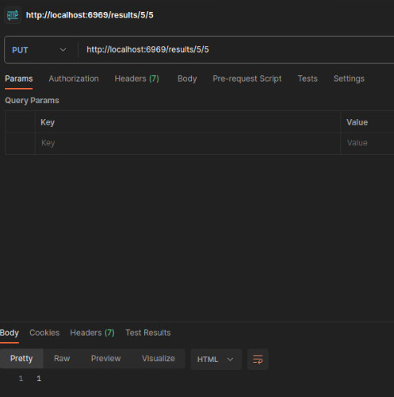
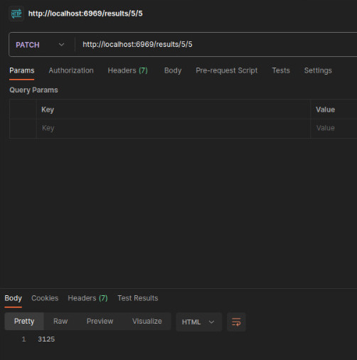
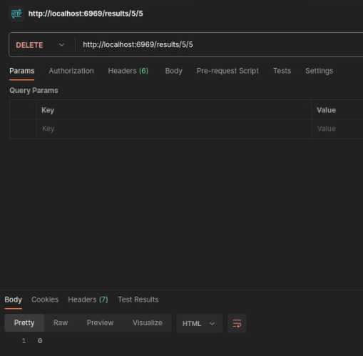

# Tarea | Tablas RESTful

Web Plataforms

## Unidad I

Introducción al Desarrollo Web

## Lenguaje de Programación

Javascript

Versión de node: v18.13.0

Versión de express: 4.18.2

## Autor

**Juan Antonio Díaz Fernández**

	Usuario: JuanDiazuwu

	Matricula: 348637

* Github de Juan: [Github](https://github.com/JuanDiazuwu)

* Gitlab de Juan: [Gitlab](https://gitlab.com/a348637)

## Instrucciones

Crear API REST utilizando la siguiente tabla RESTFull:

 * GET /results/:n1/:n2 -> Sumar n1 + n2

 * POST /results/ -> Multiplicar n1 * n2

 * PUT /results/ -> Dividir n1 / n2

 * PATCH /results/ -> Potencia n1 ^ n2

 * DELETE /results/:n1/:n2 -> restar n1 - n2

Subir liga de GitHub, GitLab o BitBucket de forma publica.

## Funcionamiento

*Ruta:*

```
    '/results/:x/:y'
```

Esta ruta permite realizar multiples operaciones matemáticas de dos números 'x' e 'y', los cuales se proporcionan como parámetros atravez de la URL.

 * Post: Multiplicación, realiza la multiplicación entre _x_ e _y_.

 * Get: Suma, realiza la suma entre _x_ e _y_.

 * Put: División, realiza la división entre _x_ e _y_.

 * Patch: Potencia, calcula _x_ elevado a la potencia _y_.

 * Delete: Resta, realiza la resta entre _x_ e _y_.

 *Ruta:*

```
    '/results/'
```

Devuelve la cadena `Results list``.

## Instrucciones de Uso

 * 1 .- Clonar el repositorio.

 * 2 .- Abrir una terminal en la raíz del repositorio.

 * 3 .- Asegurarse de tener instalado node.js

 * 4 .- Ejecutar el siguiente comando en la terminal:

```
 node index.js
```

Esto hará que el servidor se inicialize.

 * 5 .- Abrir su navegador de preferencia.

 * 6 .- En la barra de busqueda pegar.

```
http://localhost:6969/results/${primervalor}/${segundo_valor}
```

Ejemplo: 

```
http://localhost:6969/results/5/5
```

Esto mostrara en el navegador el valor `10` ya que se hace la función `get`.

 * 7 .- Se puede utilizar postman de la siguiente manera para verificar los demás valores de la tabla:

`GET`:



`POST`:



`PUT:`



`PATCH:`



`DELETE:`



 * 8 .- Para apagar el servidor, dirijase a la terminal de antes y ejecutar el siguiente par de teclas `Ctrl + C`,

Siéntase libre de clonar este repositorio y probar su funcionamiento. ¡Espero que le sea útil!